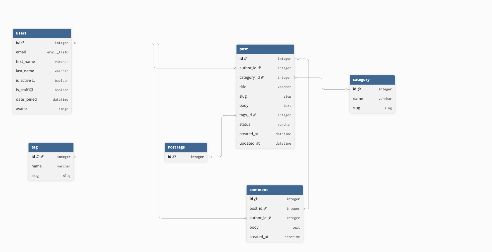

This repository contains a Blog API project built as part of an advance Django course. The project implements a RESTful API for a blog.
This is the erd diagram for models of this project


# Hw4

```bash
docker compose up --build -d
```

```bash
curl -I http://localhost/admin/login/


```bash
curl -I http://localhost/static/admin/css/base.css


```bash
curl http://localhost/blog/posts/
```


```bash
docker compose stop web
curl -I http://localhost/blog/posts/

docker compose start web
```

```bash
curl http://localhost:8000/


```bash

TOKEN="your_jwt_token_here"
SLUG="your-post-slug-here"

npx wscat -c "ws://localhost/ws/posts/$SLUG/comments/?token=$TOKEN"
